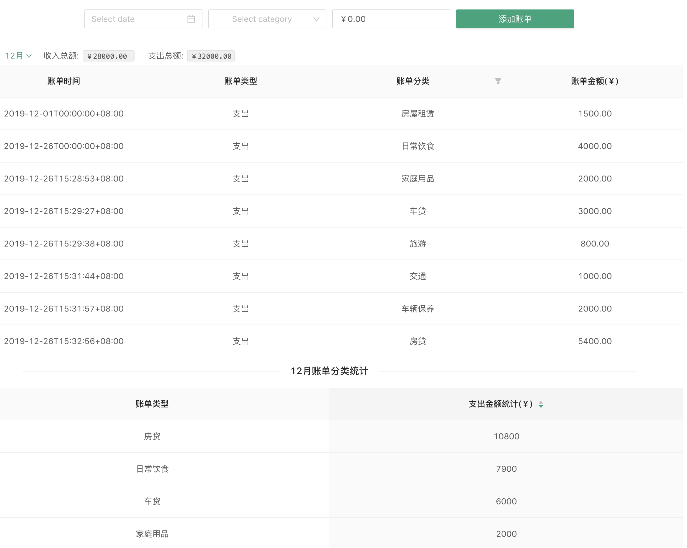
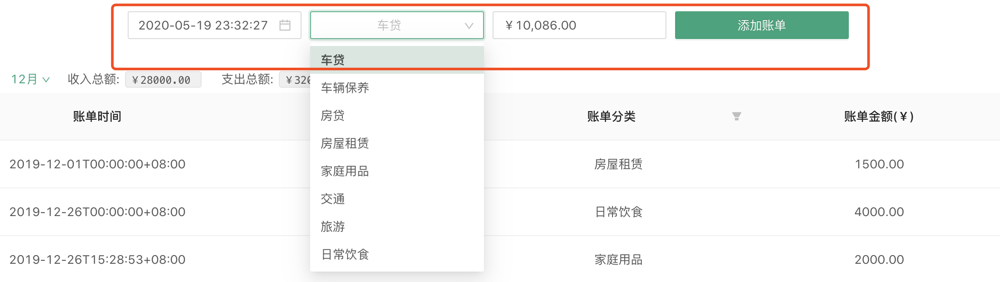
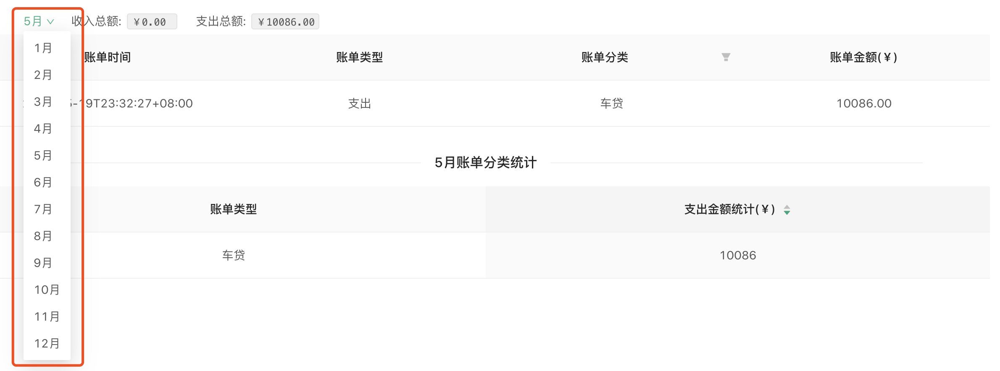
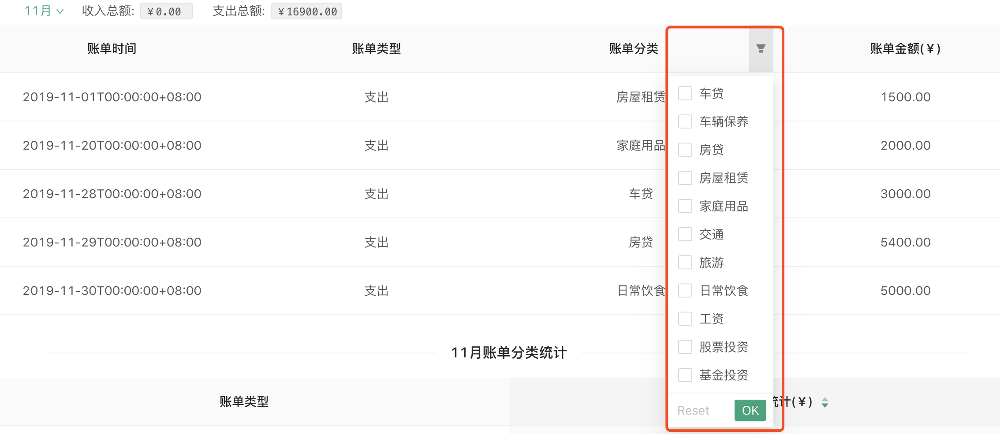

# xmind-tea

### 功能

- 加载、解析 [bill.cvs](https://github.com/xmindltd/hiring/blob/master/frontend-1/bill.csv), [categories.csv](https://github.com/xmindltd/hiring/blob/master/frontend-1/categories.csv)
- 以列表的形式展示账单内容，提供下拉框选择月份进行筛选，其中列表中所展示的账单为选择月份的账单
- 添加账单
- 统计并展示所选月份的收入和支出总金额
- 对账单分类进行二次筛选
- 对选择月份内的所有账单根据账单分类进行支出金额统计、排序

### 预览

- 加载数据，默认显示12月份账单


- 添加账单


- 选择月份


- 二次筛选账单分类


- 选择的月份分类统计支出、排序


### 使用

> env: node version >= v14.0.0

```shell
$ git clone https://github.com/damonlau27/xmind-tea.git
$ cd xmind-tea
$ yarn install  # npm install
$ yarn test     # npm test
$ yarn start    # npm start => open explorer with http://localhost:3000/
```
